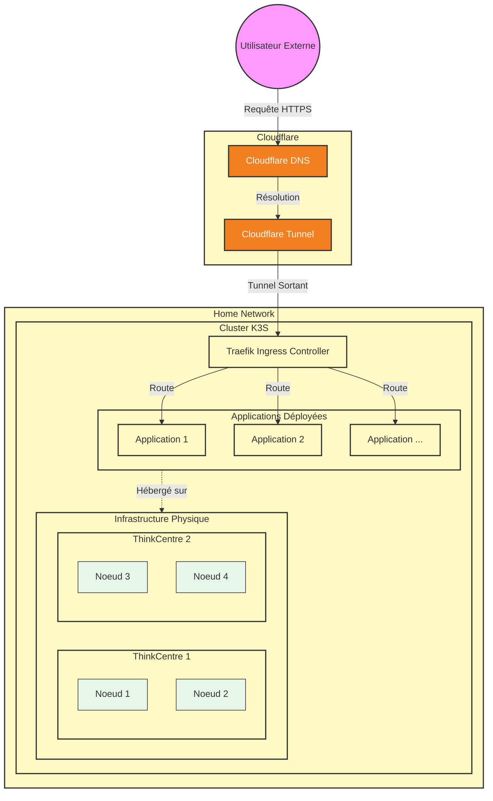

# nix-cfg

Personal NixOS configuration managed with flakes. Heavily inspired by [Vimjoyer work](https://www.youtube.com/watch?v=a67Sv4Mbxmc).

## Installation

### Using an existing host configuration

1 - Clone the repository

2 - Remove the existing hardware configuration if you want to use an already defined host: 
```bash
rm -f hosts/<host>/hardware-configuration.nix
```

3 - Regenerate the hardware configuration if you want to use an already defined host: 
```bash
sudo nixos-generate-config --show-hardware-config > hosts/<host>/hardware-configuration.nix
```

4 - Switch to the new configuration: 
```bash
sudo nixos-rebuild switch --flake .#<host>
```

### Creating a new host configuration

1 - Clone the repository

2 - Do ur stuff

3 - Generate the hardware configuration: 
```bash
sudo nixos-generate-config --show-hardware-config > hosts/<host>/hardware-configuration.nix
```

4 - Switch to the new configuration: 
```bash 
sudo nixos-rebuild switch --flake .#<host>
```

## Update && Upgrade

```bash
nix flake update
sudo nixos-rebuild switch --flake .#<host>
```

## Ollama / Opencode

Connect to the host "tour" and run the following command to run opencode with ollama
```bash
ollama launch opencode
```

## Cloud-Hypervisor

To ping a running vm from the host:
```bash
sudo ch-remote --api-socket /var/lib/microvms/{{vm-name}}/{{vm-name}}.sock ping
```

## Get the K3S conf

```bash
source ./scripts/fetch-k3s-kubeconfig.sh
```

## K3S 



## Sources

* https://www.youtube.com/watch?v=a67Sv4Mbxmc
* https://www.youtube.com/watch?v=vYc6IzKvAJQ
* https://github.com/Gabriella439/nixos-in-production
* https://www.youtube.com/watch?v=leR6m2plirs
* https://www.youtube.com/watch?v=2yplBzPCghA&t=134s
* https://www.joshuamlee.com/nixos-proxmox-vm-images/
* https://www.nijho.lt/post/proxmox-to-nixos/
* https://jrunestone.github.io/how-to-install-incus-lxd-on-nixos/
* https://microvm-nix.github.io/microvm.nix/
* https://determinate.systems/blog/nix-to-kubernetes/
* https://github.com/Gabriella439/nixos-in-production
* https://github.com/nix-community/nixos-anywhere
* https://paradigmatic.systems/posts/setting-up-deploy-rs/
* https://nlewo.github.io/nixos-manual-sphinx/index.html
* https://github.com/appleboy/ssh-action
* https://nix-tutorial.gitlabpages.inria.fr/nix-tutorial/index.html
* https://github.com/NixOS/nixpkgs/blob/master/pkgs/applications/networking/cluster/k3s/docs/USAGE.md
* https://docs.k3s.io/cli/token
* https://github.com/microvm-nix/microvm.nix/blob/main/doc/src/microvm-command.md
* https://microvm-nix.github.io/microvm.nix/simple-network.html
* https://markaicode.com/ubuntu-networking-comparison/
* https://www.cloudhypervisor.org/docs/prologue/commands/
* https://www.w3tutorials.net/blog/conditional-needs-in-github-actions/
* https://docs.k3s.io/cluster-access
* https://oneuptime.com/blog/post/2026-03-06-use-flux-operator-managing-flux-instances/view
* https://olai.dev/blog/nix-cloudflare-tunnels/
